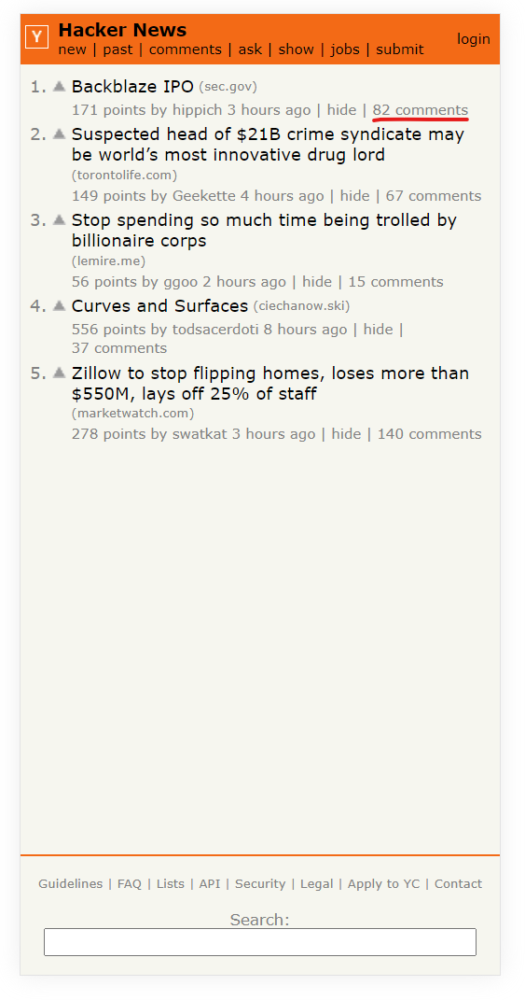

# AngularHackerNews

This project was generated with [Angular CLI](https://github.com/angular/angular-cli) version 12.2.12.

- Display the top 5 Stories;
- Display top 3 comments of those stories; (click on the comments link of each news to change page)

## Development server

Run `ng serve` for a dev server. Navigate to `http://localhost:4200/`. The app will automatically reload if you change any of the source files.

## Running unit tests

Run `ng test` to execute the unit tests via [Karma](https://karma-runner.github.io).
